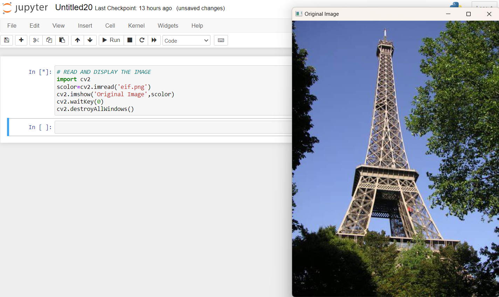
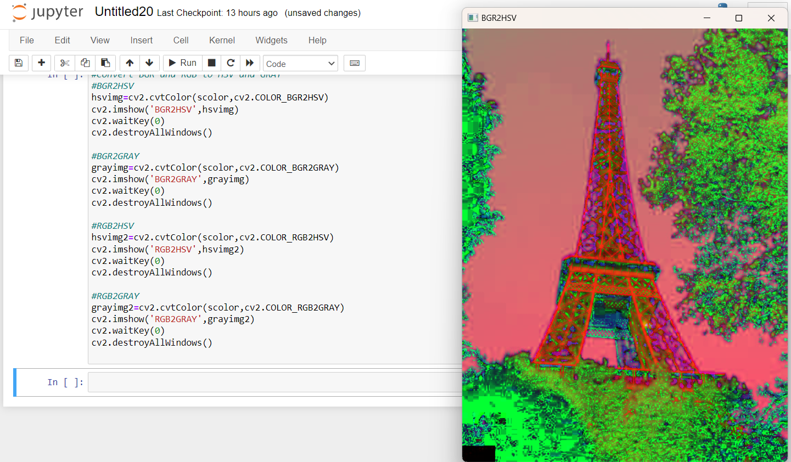
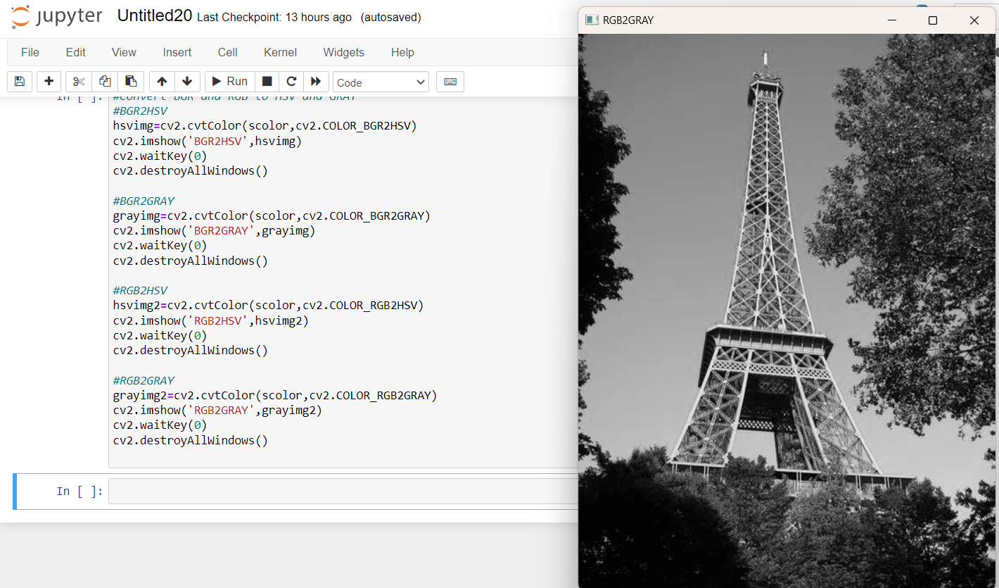
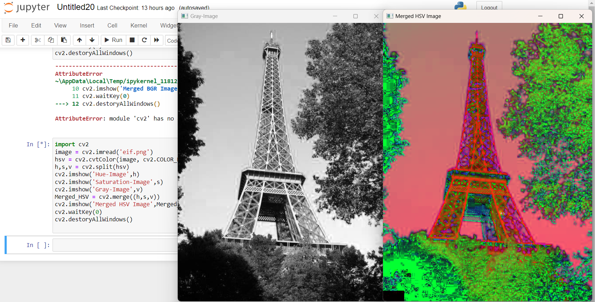
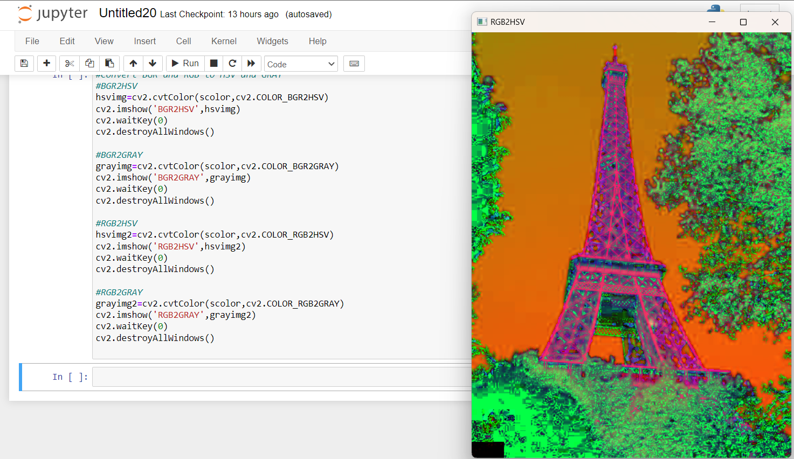
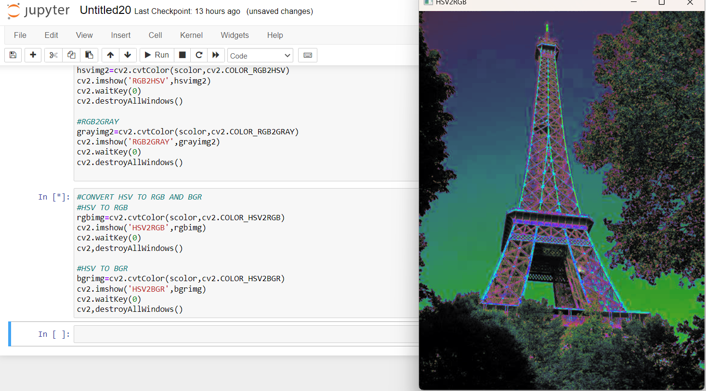
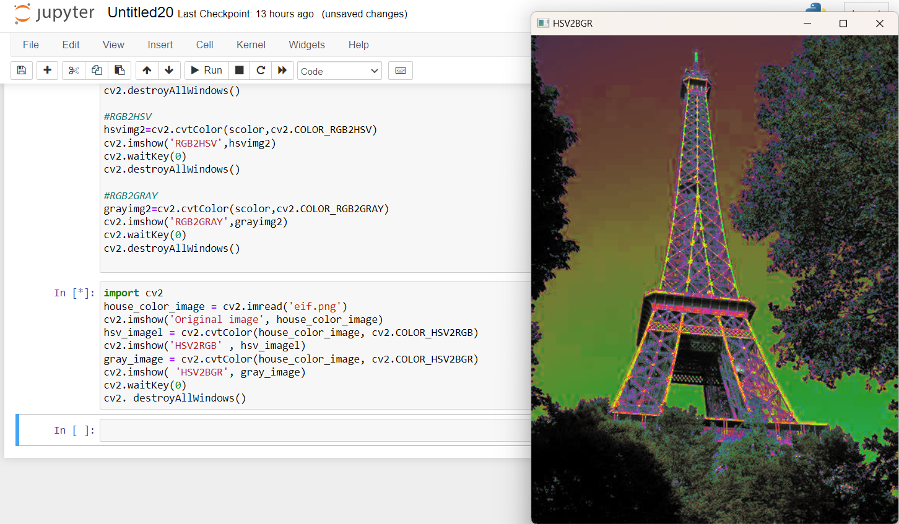
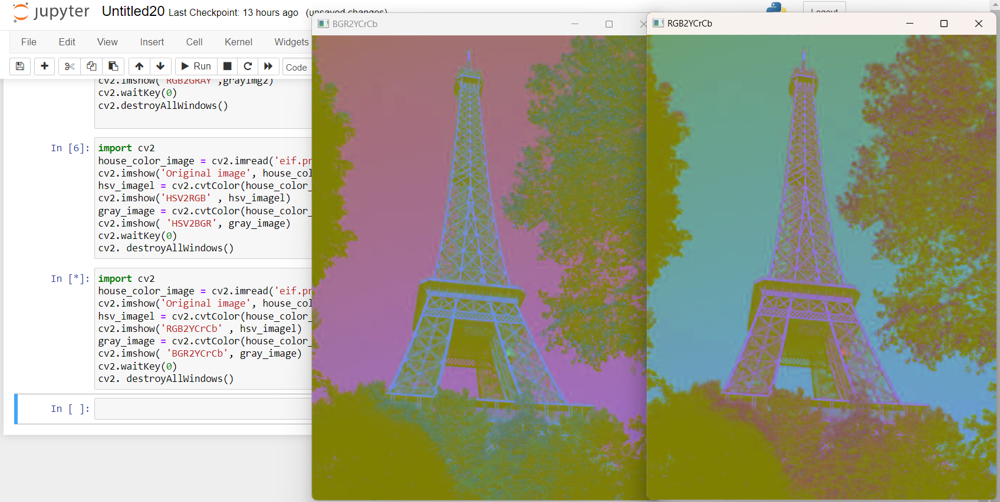
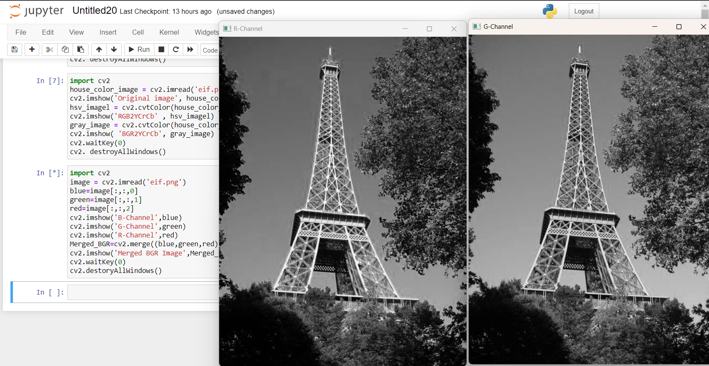
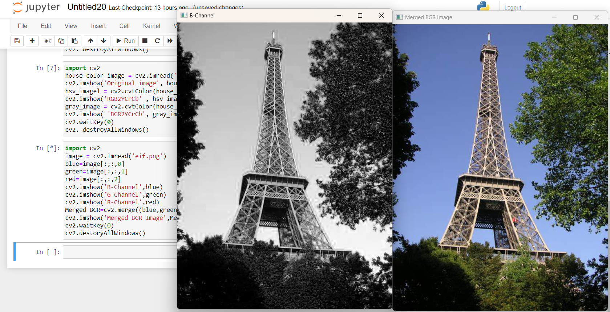

# Color Conversion
## AIM
To perform the color conversion between RGB, BGR, HSV, and YCbCr color models.

## Software Required:
Anaconda - Python 3.7
## Algorithm:
### Step1:
<br>Import cv2 library.

### Step2:
<br>Use cv2.cvtcolor() to convert color in required image.

### Step3:
<br>Use .imshow() to display and .imwrite() to save the image

### Step4:
<br>Use split() to disperse color into separate channels.

### Step5:
<br>Use merge() to combine those separate channels into color

## Program:
```python
# Developed By: VISMAYA.S
# Register Number:212221230125

# READ AND DISPLAY THE IMAGE
import cv2
scolor=cv2.imread('eif.png')
cv2.imshow('Original Image',scolor)
cv2.waitKey(0)
cv2.destroyAllWindows()

# i) Convert BGR and RGB to HSV and GRAY

#BGR2HSV
hsvimg=cv2.cvtColor(scolor,cv2.COLOR_BGR2HSV)
cv2.imshow('BGR2HSV',hsvimg)
cv2.waitKey(0)
cv2.destroyAllWindows()

#BGR2GRAY
grayimg=cv2.cvtColor(scolor,cv2.COLOR_BGR2GRAY)
cv2.imshow('BGR2GRAY',grayimg)
cv2.waitKey(0)
cv2.destroyAllWindows()

#RGB2HSV
hsvimg2=cv2.cvtColor(scolor,cv2.COLOR_RGB2HSV)
cv2.imshow('RGB2HSV',hsvimg2)
cv2.waitKey(0)
cv2.destroyAllWindows()

#RGB2GRAY
grayimg2=cv2.cvtColor(scolor,cv2.COLOR_RGB2GRAY)
cv2.imshow('RGB2GRAY',grayimg2)
cv2.waitKey(0)
cv2.destroyAllWindows()


# ii)Convert HSV to RGB and BGR

import cv2
house_color_image = cv2.imread('eif.png')
cv2.imshow('Original image', house_color_image)
hsv_imagel = cv2.cvtColor(house_color_image, cv2.COLOR_HSV2RGB)
cv2.imshow('HSV2RGB' , hsv_imagel)
gray_image = cv2.cvtColor(house_color_image, cv2.COLOR_HSV2BGR)
cv2.imshow( 'HSV2BGR', gray_image)
cv2.waitKey(0)
cv2. destroyAllWindows()


# iii)Convert RGB and BGR to YCrCb
import cv2
house_color_image = cv2.imread('eif.png')
cv2.imshow('Original image', house_color_image)
hsv_imagel = cv2.cvtColor(house_color_image, cv2.COLOR_RGB2YCrCb)
cv2.imshow('RGB2YCrCb' , hsv_imagel)
gray_image = cv2.cvtColor(house_color_image, cv2.COLOR_BGR2YCrCb)
cv2.imshow( 'BGR2YCrCb', gray_image)
cv2.waitKey(0)
cv2. destroyAllWindows()


# iv)Split and Merge RGB Image
import cv2
image = cv2.imread('eif.png')
blue=image[:,:,0]
green=image[:,:,1]
red=image[:,:,2]
cv2.imshow('B-Channel',blue)
cv2.imshow('G-Channel',green)
cv2.imshow('R-Channel',red)
Merged_BGR=cv2.merge((blue,green,red))
cv2.imshow('Merged BGR Image',Merged_BGR)
cv2.waitKey(0)
cv2.destoryAllWindows()


# v) Split and merge HSV Image

import cv2
image = cv2.imread('eif.png')
hsv = cv2.cvtColor(image, cv2.COLOR_BGR2HSV)
h,s,v = cv2.split(hsv)
cv2.imshow('Hue-Image',h)
cv2.imshow('Saturation-Image',s)
cv2.imshow('Gray-Image',v)
Merged_HSV = cv2.merge((h,s,v))
cv2.imshow('Merged HSV Image',Merged_HSV)
cv2.waitKey(0)
cv2.destoryAllWindows()


```
## Output:

### read and display : 

### i) BGR and RGB to HSV and GRAY
<br>

<br>

### ii) HSV to RGB and BGR
<br> 
<br>

### iii) RGB and BGR to YCrCb
<br>
<br>

### iv) Split and merge RGB Image
<br>
<br>

### v) Split and merge HSV Image
<br>
<br>


## Result:
Thus the color conversion was performed between RGB, HSV and YCbCr color models.
